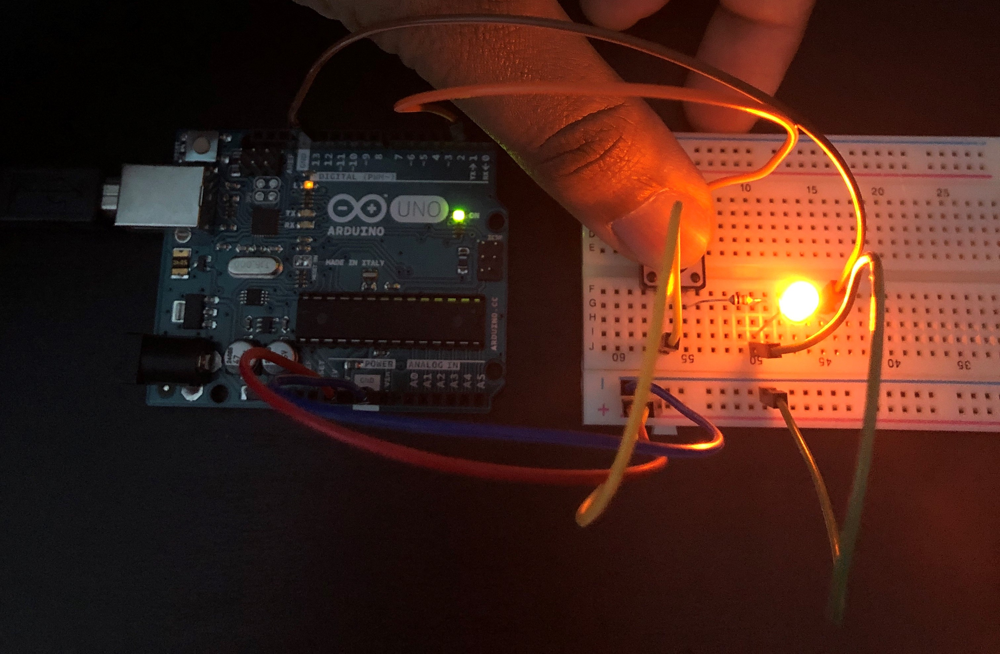

# Add your page title and name here
<!--
Welcome to your project page for Electronics for the Rest of Us. You'll use this page to describe and showcase your work throughout the module. 
A place for each deliverable has been created below for you in this markdown document. 
Note that comments (such as this) will not appear in the final markdown document (which you can view with the "Preview" button).
-->


## Day 1: Reflection
<!--
In this section, provide a ~250 word reflection on your first day of the module, and discuss why you're interested in this module and what you hope to take away from it.

You're also asked to insert a photo that represents your accomplishments on your first day. 
- Take a photo of you working or one of your circuits and upload it to the /docs/images/ folder of this repository. 
- Then, insert your photo into your document by modifying the markdown example that has been inserted below.
-->

I chose to participate in this module because as a student majoring in `Computer Science`, I have been learning about different programming languages, number types, and other software related aspects. This module made me realize that I had never tackled the *hardware side*, so I instantly seized the opportunity.  By the end of the module, I want to be able to build a circuit that could be applied to an object in the real world such as an **alarm** or **traffic light**. On the first day, I created a website using markdown, a plaintext formatted language. I find Markdown to be intriguing because of how easy it makes it to style text on the web. For example, if you want a heading, you can simply add a hash behind the text. To make the heading smaller, more hashes can be added. The convenience and ease that comes with this language makes it possible for anyone to design websites, even people who have no programming experience. In the future, if I am making a website for the description of my project, I would definitely choose Markdown over HTML to design it. It simply saves time and is also very easy to learn.

<!--
Inserting an image takes the form: 

See the following webpage for more information: https://github.com/adam-p/markdown-here/wiki/Markdown-Cheatsheet#images
Replace the elements below to insert your picture.
--> 


## Day 2: Results
<!--
Upload your fully-commented Arduino sketch from your final Day 2 build task--a thermometer connected to an RDB LED--into your GitHub repository.
Provide a short (~150 words) summary of your work on this circuit:
- How does your device work?
- What was challenging? 
- What worked? What didn't? 
- Be sure to link to your code (in your GitHub repository) in the text of your response.
-->
The thermistor finds the temperature of the room and relays it to the arduino. This is where the map function is used on a range of temperatures (26 - 30) to colours (0 - 255). Then depending on this mapped number, the color of the led is changed. A number less than 80 changes to blue, greater than 180 changes to red, and otherwise, the color changes to yellow. I found it challenging to find an accurate way to change the colour depending on the temperature. Initially, even though the colour was right, the brightness was not matching. For example, when the value is less than 80, the colour (0, 0, 80) is not bright, so I had to multiply the number by 3. However, changing the color accurately did not work. The range between 0 and 80, or 180 and 255, should not have one colour, but the overall colour changing worked.

[Here is a link to the code](https://github.com/inspire-1a03/intersession-2020-SaribK/blob/master/Thermistor_with_RGB_LED.ino)

## Arduino build-off results
<!--
Upload your fully-commented Arduino sketch from the final product of your Arduino build-off into the top-level of your module GitHub repository.
In ~300 words, provide a final device description and product pitch: 
- What does it do? Use a table (created in markdown) to list and describe the features. You can use the template provided below. 
- Describe briefly how it works.
- How could it be used in everyday life (or maybe just in rare cases)? 
- Be sure to link to your code (in your GitHub repository) in the text of your response.
- Include a snippet of code using the ``` ``` characters to display the code properly. 
Finally, record a short (30 second) video of a 'product pitch' for your device. 
- Upload the video to Youtube, and use the sample code below to embed your video.
-->


<!--
Below is a general markdown table template. 
You can find more information at these links: 
- https://github.com/adam-p/markdown-here/wiki/Markdown-Cheatsheet#tables

-->
| Feature                              | Description | Other Notes |
|:---------:                           |-------------|-------------|
| Motion Sensor                        | Uses photoresistor to sense when there is a disruption in the brightness. If a person walks past the photoresistor or waves their hand, the arduino detects it.          | The alarm is triggered when the brightness drops below a certain level, but depending on the location or time of day, the brightness may already be too low. In the code, that number would have to be adjusted to ensure that the brightness that it must drop too is a reasonable number             |
| Volume Adjuster                      | The volume of the piezo buzzer can be adjusted with the potentiometer.                                                                                                       | N/A            |
| Green/Red Light and Alarm Sound      | When the photoresistor detects motion, the rgb led turns red to indicate an intruder, and the piezo buzzer is activated.                                                    | N/A            |
| On/Off Button                        | A button has to be clicked to initiate the alarm. When the button is clicked, the light turns green to indicate that it was turned on.             | N/A            |

The arduino checks if the button is clicked, and in the case that the button is clicked, then checks if the brightness being inputted by the photoresistor is lower than a specified number. If the number is lower, then that means there is a disruption in the brightness, and the alarm is triggered. The specified number must be a reasonable number. It is easily found with the serial monitor. Simply check the brightness when there is nothing in the way of the photoresistor, and then check when you wave your hand. This product can be used as an alarm, since it is an alarm system. If you have a candy jar that you would not want your kids eating, you can put the alarm system near the jar, and when someone reaches into the jar, the alarm will activate scaring them away. This product can be used for keeping any small product safe. 

<!--
Below is an example of embedding a YouTube video in a markdown document for use in GitHub pages. 
Note that this video won't show when previewing the document in GitHub--it only works on the GitHub pages webpage. 
- Once your YouTube video is uploaded, right click and select ```<> Copy embed code```. 
- You can paste this code directly into your markdown document. 
- Note that you may want to adjust the width and height parameters to make it fit well in your webpage
-->

<iframe width="789" height="444" src="https://www.youtube.com/embed/dQw4w9WgXcQ" frameborder="0" allow="accelerometer; autoplay; encrypted-media; gyroscope; picture-in-picture" allowfullscreen></iframe>


## Final reflection & summary
<!--
In ~300 words:
- Summarize your experience in this module. What you learned, what you liked, what you found challenging.
- Reflect upon your learning and its relevance in your life.
-->
